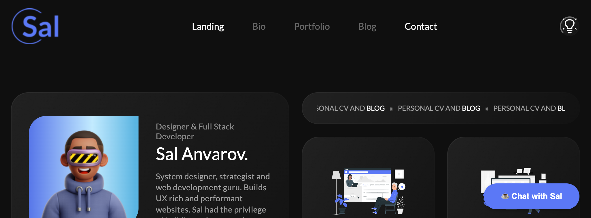

<h1 align="center">Ali's Personal Portfolio Website</h1>

<p align="center">
  <a href="http://alialhaddad.com/" target="blank"></a>
</p>

<p align="center">A modern <a href="https://www.nextjs.org" target="blank" rel="noreferrer noopener">Next.js</a> portfolio website built with 💙 and ☕ by Ali Alhaddad. <a href="https://www.alialhaddad.com" target="blank" rel="noreferrer noopener">Deployed</a> with <a href="https://www.hotjar.com/" target="blank" rel="noreferrer noopener">HotJar</a>, <a href="https://tagmanager.google.com/#/home" target="blank" rel="noreferrer noopener">GTM</a>, and <a href="https://formspree.io/" target="blank" rel="noreferrer noopener">Formspree</a> tools for analytics and form tracking.
</p>

[
2. [Prerequisites](#%EF%B8%8F-prerequisites)
3. [Deployment](#-deployment)
4. [Environment Configuration](#-environment-configuration)
5. [Repository Files and Folders](#-repository-files-and-folders)
6. [Testing](#-testing)

🔎 This repo was created with [Nx](https://nx.dev/).

### 📚 Description

Preview: https://www.alialhaddad.com/

This portfolio website was built with ease of extensibility in mind. This app comes with **MDX** for case-studies and blog management and **Bootstrap** for styling. The app has redux state management via **Redux Toolkit** and **React Hooks**.

> Remark: Given **App Router** is not fully stable, I opted to stay with **Pages Router** until further notice. The plan is to eventually migrate to **App Router**.

---

### 🛠️ Prerequisites

#### Tracking Tools

- [HotJar](https://www.hotjar.com/)
- [Google Analytics](https://www.marketingplatform.google.com)
- [Microsoft Clarity](https://clarity.microsoft.com)
- [DebugBear RUM](https://www.debugbear.com/docs/rum/real-user-monitoring)
- [Vercel Analytics](https://vercel.com/docs/analytics/quickstart)

#### Non Docker

- Please make sure to have [Node.js](https://nodejs.org/en/download/) (16+) locally by downloading the Javascript runtime via `brew`, `choco`, or `apt-get`.

#### Docker 🐳

- Please make sure to have [Docker Desktop](https://www.docker.com/products/docker-desktop/) operational to quickly compose the required dependencies. Then follow the docker procedure outlined below.

---

### 🚀 Deployment

#### Manual Deployment without Docker

- Clone the repo via `git clone https://github.com/AliA1997/personal-portfolio`.

- Navigate to the root directory of repo via `cd personal-portfolio`.

- Download dependencies via `npm i` or `yarn`.

- Create a **.env file** via the `cp apps/personal-portfolio/.env.example .env` command and replace the example environment variables with valid ones.

- Start the app in development mode via `npm run start` (the app will be exposed on http://localhost:4200; not to conflict with the default React, Angular, or Vue ports).

> Remark: In the docker deployment, the UI is automatically started and served by the API.

#### Deploying with Docker 🐳

[Open in Docker Dev Environments ](https://open.docker.com/dashboard/dev-envs?url=https://github.com/AliA1997/personal-portfolio/tree/master)

- Execute the following command in-app directory:

```bash
# creates and loads the docker container in detached mode with the required configuration
$ docker-compose up -d
```

- The following command will download dependencies and execute the web application on http://localhost:80 (deployed behind a Nginx reverse proxy).

---

### 🔒 Environment Configuration

By default, the application comes with a config module that can read in every environment variable from the `.env` file.

**APP_ENV** - the application environment to execute as, either in development or production. Determines the type of logging options to utilize. Options: `development` or `production`.

**ENABLE_TRACKING** - enables tracking tools. Options: `true` or `false`.

**HOTJAR_WEBSITE_UID** - hotjar website uid, requires a HotJar account (**free**)

**HOTJAR_VERSION** - hotjar version

**GOOGLE_TAG_MANAGER_UID** - google tag manager uid, requires google analytics to be onboarded.

**MICROSOFT_CLARITY_UID** - microsoft clarity uid, manages heatmaps and events. requires a Microsoft account (**free**)

> Remark: DebugBear can be easy onboarded via [Vercel](https://vercel.com/integrations/debugbear)

**DEBUGBEAR_RUM_UID** - debugbear real user monitoring (RUM) uid, requires DebugBear to be onboarded (**free**).

---

### 📁 Repository Files and Folders

```text
.
├── Dockerfile
├── README.md
├── apps
│   ├── personal-portfolio
│   │   ├── case-studies
│   │   ├── index.d.ts
│   │   ├── jest.config.ts
│   │   ├── next-env.d.ts
│   │   ├── next.config.js
│   │   ├── pages
│   │   ├── posts
│   │   ├── project.json
│   │   ├── public
│   │   ├── tests
│   │   ├── tsconfig.json
│   │   ├── tsconfig.spec.json
│   │   └── utils
│   └── personal-portfolio-e2e
│       ├── cypress.config.ts
│       ├── project.json
│       ├── src
│       └── tsconfig.json
├── assets
│   └── open-link.svg
├── compose.yaml
├── dist
│   └── apps
│       └── personal-portfolio
├── jest.config.ts
├── jest.preset.js
├── libs
│   ├── core-components
│   │   ├── README.md
│   │   ├── project.json
│   │   ├── src
│   │   ├── tsconfig.json
│   │   └── tsconfig.lib.json
│   └── store
│       ├── README.md
│       ├── project.json
│       ├── src
│       ├── tsconfig.json
│       └── tsconfig.lib.json
├── nx.json
├── package-lock.json
├── package.json
├── tools
│   └── tsconfig.tools.json
└── tsconfig.base.json
```

---

### ✅ Testing

#### Docker 🐳

```bash
# Start the docker container if it's not running
$ docker start frontend

# unit tests
$ docker exec -it frontend npm run test

```

#### Non-Docker

```bash
# execute test
$ npm run test
```

---

### 🏗️ Progress

|                                                            Branches | Status |
| ------------------------------------------------------------------: | :----- |
|             [main](https://github.com/AliA1997/personal-portfolio) | ✅     |
| [feat/\*](https://github.com/AliA1997/personal-portfolio/branches) | 🚧     |

<!-- > Remark: This template was employed to create a [Real World example app](https://github.com/gothinkster/realworld) on [Github](). -->

---

### 👥 Help

PRs are appreciated, I fully rely on the passion ❤️ of the OS developers.

---

## License

This personal portfolio website is [MIT licensed](LICENSE).

[Author](https://www.linkedin.com/in/ali-alhaddad/)
